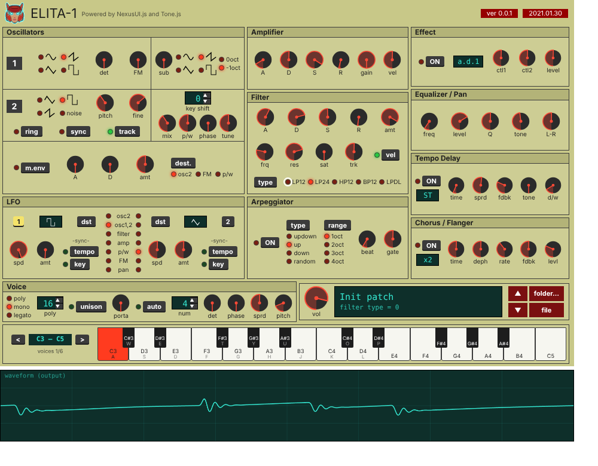

# ELITA-1

Synth1 のパッチ（`.sy1`）をブラウザで試聴するための、フリーのシンセサイザー。
画面は NexusUI.js、音は Tone.js（Web Audio）で作っています。

> **Synth1 の再現ではありません。** 内部構成（OSC → Filter → Amp、LFO、Mod Envelope、各エフェクト）は Synth1 に合わせていますが、各つまみの値と音色の対応は推測を含み、Synth1 と同じ音にはなりません。パッチの「だいたいの傾向」を聴くためのものです。
> 本プロジェクトは Synth1 の作者・配布元とは無関係の非公式プロジェクトです。




## 特長

- Synth1 風の画面（Oscillators / LFO / Amplifier / Filter / Arpeggiator / Effect / EQ・Pan / Tempo Delay / Chorus / Voice）。MIDI 部は省略したコンパクト版
- 6 ボイス・ポリフォニック（mono / legato、portamento、unison に対応。unison は 1 オシレーターあたり最大 4 本に制限）
- `.sy1` パッチの読み込み（1 ファイル、またはフォルダを指定して ↑↓ キーで切り替え）
- 画面下の鍵盤と PC キーボードで演奏（オクターブ切替あり）
- 出力波形のオシロスコープ表示
- 画面右側に、パッチの全パラメーターを文字で一覧表示（変更した項目を強調、`changed only` で絞り込み、`copy text` でコピー）。**値の欄は入力欄になっていて、数字を打って Enter（または欄の外をクリック）で、そのパラメーターを変更できます**。↑↓ で ±1（Shift で ±8）、Esc で取り消し。範囲外の数字は範囲内に丸め、数字以外は元に戻します。つまみや音にもすぐ反映されます
- コンソールで音の経路を確認できるデバッグモード

## 使い方

### 起動

ビルドは不要です。ただし `file://` で直接開くとブラウザによっては制限があるため、簡易サーバー経由を推奨します。

```bash
cd elita1
python3 -m http.server 8000
# ブラウザで http://localhost:8000/index.html を開く
```

Tone.js と NexusUI は `js/` に同梱しているので、ネットワーク接続なしで動きます。

画面内を一度クリックするか鍵盤を押すと、オーディオが始まります（ブラウザの自動再生規制のため）。

### 演奏

| 操作 | 内容 |
| --- | --- |
| 画面下の鍵盤をクリック | 発音 |
| `A W S E D F T G Y H U J K O L P` | 鍵盤（C から 1 オクターブ半） |
| `Z` / `X`（または `<` `>` ボタン） | オクターブ下げる / 上げる（C3〜C5 の表記が切り替わります） |

### パッチの読み込み

- `file` ボタン、または `.sy1` ファイルのドラッグ＆ドロップで 1 つ読み込み
- `folder…` ボタンで `.sy1` の入ったフォルダを指定（直下のみ、名前順）

フォルダ指定後のキー操作:

| キー | 動作 |
| --- | --- |
| `↑` | 次のパッチ |
| `↓` | 前のパッチ |

端まで行くと反対側に回り込みます。画面の ▲▼ ボタンも同じ向きです（▲ が次、▼ が前）。
Chrome / Edge ではフォルダ選択ダイアログ、Firefox / Safari ではフォルダのアップロード画面になります。ページを再読み込みするとフォルダ指定はやり直しです。

### つまみの操作

- ドラッグ（上下）で値を変更、マウスホイールで ±1（Shift で ±8）
- ダブルクリックで既定値に戻す
- LCD 風のボタンは、クリックで次へ、右クリックで前へ、ホイールでも切り替え

### デバッグモード

`index.html?debug` で開くか、コンソールで `ELITA.debug.on()` を実行します（`ELITA.debug.off()` で終了）。

| コマンド | 内容 |
| --- | --- |
| `ELITA.debug.graph()` | 全体の信号経路（ボイスごとの状態、エフェクト段の ON/OFF と値、LFO の行き先） |
| `ELITA.debug.voice(i)` | i 番ボイスの内訳（OSC1/2、Sub、Noise、Ring、Sync、FM の音量など） |
| `ELITA.debug.meters()` | 各段の音量（dB）。音を鳴らしながら実行 |
| `ELITA.debug.params()` | 既定値から変更された項目と、エンジンが使っているか |
| `ELITA.debug.unused()` | エンジンが読んでいないパラメータの一覧 |

デバッグ中は、鍵盤を押すたびに「どのボイスで、どの経路を通って鳴っているか」、つまみを動かすたびに「どの番号が何から何に変わったか」がコンソールに出ます。

## 構成

```
elita1/
├── index.html          メイン画面（パネル + 鍵盤 + 波形 + パラメーター一覧）
├── css/
│   ├── reset.css
│   ├── style.css       Synth1 風の見た目
│   ├── compact.css     コンパクト版の配置
│   └── params.css      パラメーター一覧の見た目
├── docs/               スクリーンショット
├── img/                アイコン（e1.png）と波形アイコン（SVG）
└── js/
    ├── Tone.js         Tone.js 14.8.49（同梱）
    ├── NexusUI.js      NexusUI（同梱）
    ├── ui.js           画面。つまみを Synth1 のパラメータ番号で登録
    ├── engine.js       音源エンジン（Tone.js）とデバッグモード
    ├── keys.js         鍵盤（画面 / PC キー）
    ├── patches.js      フォルダ指定とパッチ切り替え
    ├── scope.js        オシロスコープ
    └── params.js       パラメーター一覧（画面右側）
```

### 仕組み

画面（`ui.js`）は、すべてのつまみを Synth1 のパラメータ番号（0〜98）で管理し、`window.ELITA` として公開します。

```js
ELITA.params          // 現在値 { 番号: 値 }
ELITA.onChange        // (番号, 値) => {} つまみが動くたびに呼ばれる
ELITA.set(no, value)  // コールバックなしで値を設定
ELITA.loadSy1(text)   // .sy1 のテキストを読み込む
```

`engine.js` は `ELITA.onChange` を受けて Tone.js の各ノードを更新します。画面と音源が分かれているので、音源だけ差し替えることもできます。

信号経路:

```
[OSC1 | OSC2 | RING | SYNC | NOISE | SUB] → Filter（+Filter Env） → Sat → Amp（+Amp Env） → ボイス合算
  → Master → EQ → Chorus → Delay → Pan → Limiter → SoftClip → 出力
LFO1 / LFO2（全ボイス共通）、Mod Envelope（ボイスごと）が、ピッチ / フィルター / アンプ / P/W / FM を変調
```

### `.sy1` の形式

1 行目がパッチ名、2 行目が `color=…`、3 行目が `ver=…`、以降が `番号,値` の行です。`ver` により項目数が違い（106 / 108 / 113 で 75 / 87 / 99 個）、足りない項目は既定値で補います。

## 既知の課題・制限

### 音が Synth1 と違う点

- **パラメータのカーブは暫定です。** フィルター周波数、時間（ADSR）、LFO 速度、FM 深さ、Delay 時間、Chorus などの値と実際の量の対応は、耳で合わせたものではなく推測です。Synth1 と比べて、音量・明るさ・変調の深さがずれます。
- **フィルターが閉じ気味になるパッチがあります。** 周波数が低くレゾナンスが高いパッチ（例: Angry Leader）は、ほぼ無音に近くなります。周波数の対応づけが本物より低い可能性があります。`ELITA.debug.meters()` で、どの段で音量が落ちるかを確認できます。
- フィルターの `LPDL`（Synth1 独自のフィルター）は、LP24 で代用しています。
- LFO の波形番号（`#42` / `#47`）は、`1 = tri`、`2 = pulse`、`3 = s&h` を実機で確認しました。`0 = saw`、`4 = sine`、`5 = rnd` は推測です。`s&h` は乱数の階段状の値、`rnd` はなめらかに変わる乱数として、タイマーで生成しています（Synth1 本来の動きとは細部が異なります）。
- フィルターの `sat`（`#23`）は、フィルターの直後に tanh のサチュレーターを並列に入れた近似です（0 で完全バイパス）。Synth1 本来の歪み方とは異なります。
- 出力に簡易のソフトクリップがかかっています（レゾナンスが大きいときの音量の跳ね対策）。

### 未実装のパラメータ（画面にはあるが音に効かない）

`ELITA.debug.unused()` で現在の一覧を確認できます。主なもの:

- Effect 部（`#77–81`）
- フィルターの `vel` スイッチ（`#24`）、アンプの `vel`（`#30`）
- osc の `track`（`#4`）、`tune`（`#72`）、`det`（`#76`）
- Unison の pan 幅・ピッチ（`#84`, `#85`）、位相（`#91`, `#92`）
- MIDI 関連（`#50`, `#51`, `#86–89`）

### 最近実装したもの

- LFO の tempo sync（`#67` / `#69`）: 速度つまみが拍の分割（64 拍〜1/8 拍の 17 段階）を選びます。テンポは画面下の BPM 欄（既定 120、40〜300）で変えられ、Delay の時間にも使います（Synth1 ではホストから取る値です）。分割の並びは暫定です。
- Arpeggiator（`#59` on、`#31` type、`#32` oct range、`#33` beat、`#34` gate）: ON の間、押している鍵盤を拍に合わせて順に鳴らします（ラッチなし、全部離すと止まります）。テンポは BPM 欄です。type は 1 = up、2 = down、3 = up/down、4 = random と仮定しています（ファクトリーでは 1 がほとんど）。beat は 0〜18 の段階（11 = 1/16 拍、数字が大きいほど速い）で、19 以上の値は 127 を 18 に縮めて扱います。beat の対応表は暫定です。gate は 1 ステップに対する音の長さ（値 / 127）です。
- EQ の tone（`#60`）: 64 が平坦で、上げると明るく（高域 +、低域 −）、下げると暗くなります（高域・低域とも最大 ±9 dB 程度）。カーブは暫定です。
- Velocity: アンプの `vel`（`#30`）は、0 で強さに関係なく一定、127 で強さに比例して音量が変わります。フィルターの `vel`（`#24`）スイッチを ON にすると、フィルターエンベロープの量も強さに比例します。基準の強さは 0.8（PC キーボードの固定値）で、PC キーで弾いたときの音は、Velocity 実装前と同じです。画面の鍵盤は、クリックした高さで強さが変わります（上が弱く、下が強い）。カーブは暫定です。
- LFO の key sync（`#68` / `#70`）: 発音ごとに LFO の位相を戻します（s&h / rnd は新しい値を引きます）。
- Delay の type / spread / tone（`#82` / `#83` / `#98`）: type は 0 = ST（左右独立）、1 = X（フィードバックが左右交差）、2 = PP（モノ入力のピンポン）と仮定しています。spread は右の遅延時間を最大 1.5 倍に、tone は帰還路のローパス（0 = 素通し、127 = 約 1.5 kHz）にします。番号の対応と値のカーブは推測です。

### 値の対応が未確認のもの

次は、手元のパッチと実機の表示を突き合わせて決めたもの、または推測です。

波形番号の対応表（◎ = 実機の表示で確認済み、△ = 推測）:

| 場所 | 0 | 1 | 2 | 3 | 4 | 5 |
| --- | --- | --- | --- | --- | --- | --- |
| OSC1（`#0`） | sine △ | saw △ | pulse ◎ | tri ◎ | – | – |
| OSC2（`#1`） | （実機に無い）△ | saw ◎ | pulse ◎ | tri ◎ | noise ◎ | – |
| Sub（`#96`） | sine △ | tri ◎ | saw △ | pulse △ | – | – |
| LFO（`#42` / `#47`） | saw △ | tri ◎ | pulse ◎ | s&h ◎ | sine △ | rnd △ |

- OSC2 の画面には sine がありません（tri / pulse / saw / noise の4つ）。`#1 = 0` のとき、エンジンは sine で鳴らします。
- OSC1 の `0`・`1` は、実機での点灯をまだ確認していません。
- LFO の `0`・`4`・`5` は、残りの波形（saw / sine / rnd）をどう割り当てたかが推測です。
- Play mode の番号（0 poly / 1 mono / 2 legato）は、ファクトリープリセットで mono（1）がドラム・Sequence 系、legato（2）がソロ Lead 系に使われていることから、ほぼ確実です。
- Chorus の type は、値 N を `xN` として扱い、`x1` と `x2〜x4` の違いを近似しています。`x0` と `x3` は未検証です。
- `#94`（名前なし）は意味が未確定です。ファクトリープリセット（ver=105）には含まれません。画面の poly 数は 6 ボイスで頭打ちです。
- パッチ内に範囲外の値（`#9` の負値、`#86` / `#88` の大きな値）があります。key shift の負値は半音シフトとして扱っています。

### ファクトリープリセット 128 音色での検証

Synth1 のファクトリープリセット相当 128 音色（すべて `ver=105`、パラメータ 0〜72 のみ）を、全件エンジンに通して確認しました。

- 読み込み・発音でエラーなし。ピークが 0.95 を超える（歪む）音色なし。
- 無音の音色なし（hat は極端に短い打楽器音で、測定窓では拾えない程度）。
- 値の範囲: `#14` は 0〜3、`#31` は 1〜4、`#32` は 0〜3、`#38` は 0〜2、`#41` は 1〜5、`#42` は 0〜5、`#46` は 0〜5、`#47` は 1〜3、`#64` は 1 / 2 / 4。`#1` に 0 はなし。いずれも現在の選択肢の範囲内です。
- `#23`（sat）は 123 音色が 0 で、効くのは 5 音色だけです。

### その他

- ボイス数は 6 固定です。Synth1 の最大ポリ数とは異なります。
- Web MIDI（外部キーボード）には未対応です。
- 画面は 960px 固定で、スマートフォンの縦画面には最適化していません。タッチでの演奏は画面の鍵盤で可能です。
- ブラウザは Chrome / Edge / Firefox / Safari の最新版を想定しています。ハードシンク（OSC2 の sync）は AudioWorklet を使うため、AudioWorklet が使えない環境では無効になります。
- unison の本数は、CPU 負荷と音色の再現性のため最大 4 に制限しています（`engine.js` の `UNI_MAX`）。パッチの `#93` が 5 以上のときは 4 に丸め、パラメーター一覧に `clamped → 4` と出ます。パルス波は unison の対象外です（OSC が pulse の間は、unison が ON でも1本のままです。例: ebm bass）。
- 長時間の連続再生や、多数のボイス + unison + Chorus 2 段での CPU 負荷は未検証です。

## 今後の候補

- 各カーブを、Synth1 の音と比べて耳で調整
- Effect 部の実装
- Web MIDI 対応
- フォルダ内のパッチ一覧表示（クリックで選択）、直前のフォルダの記憶
- スペクトラム表示

## 更新履歴

[history.md](history.md) を参照してください。

## 使用ライブラリ

- [Tone.js](https://tonejs.github.io/) 14.8.49（MIT License）
- [NexusUI](https://nexus-js.github.io/ui/)（MIT License）

## ライセンスと注意

- このリポジトリのコードのライセンスは、公開時に決めて `LICENSE` を追加してください（例: MIT）。
- **Synth1 のパッチ（`.sy1`）は、それぞれの作者に権利があります。** 許可なくリポジトリに含めて再配布しないでください。本リポジトリにはパッチを含めていません。
- 「Synth1」は、作者（Ichiro Toda 氏）の製品名です。本プロジェクトは非公式であり、作者・配布元とは関係ありません。
- `img/e1.png` は本プロジェクト用のアイコンです。再利用する場合は、作者の意向に従ってください。
